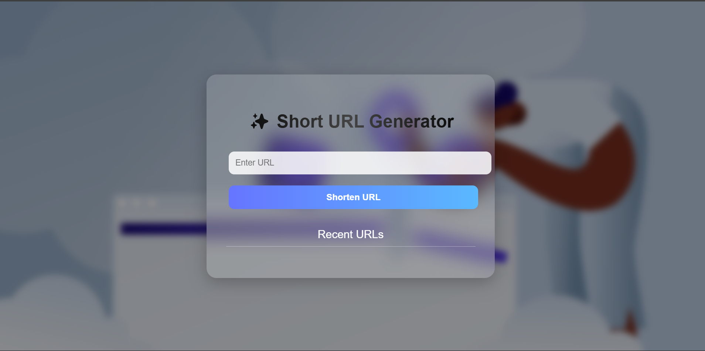
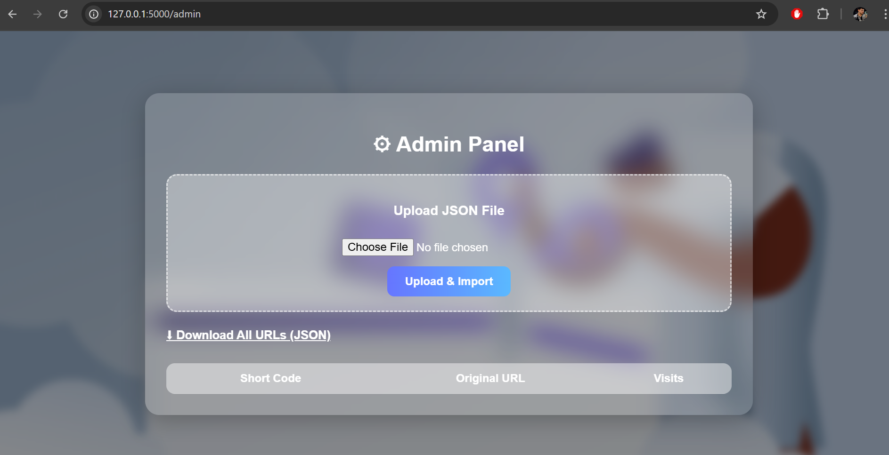
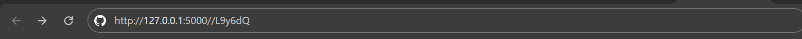

🚀 URL Shortener Web Application

A modern and lightweight URL Shortener built using Python, Flask, SQLite, and SQLAlchemy, with a beautiful startup-style UI.
This app allows users to create short URLs, track visits, manage links, and import/export data through an admin panel.

🌟 Features
🔗 User Features

Generate short URLs instantly

Custom short-code option

View list of recently created URLs

Click tracking (visit count)

Delete URLs

Glassmorphism + startup-style UI

🛠 Admin Features

Upload JSON file to import bulk URLs

Export all URLs to JSON format

View all stored URLs with click counts

Collision-safe import logic

⚙️ Backend Features

Random unique short-code generation algorithm

Flask routing and redirection

SQLite database (file-based)

SQLAlchemy ORM

Clean and scalable folder structure

| Component   | Technology                 |
| ----------- | -------------------------- |
| Language    | Python                     |
| Framework   | Flask                      |
| Database    | SQLite                     |
| ORM         | SQLAlchemy                 |
| Frontend    | HTML, CSS, Jinja Templates |
| UI Style    | Glassmorphism, Gradient UI |
| Data Format | JSON                       |

📁 Project Folder Structure

URL_SHORTENING/
│── app.py
│── models.py
│── database.py
│── requirements.txt
│
├── instance/
│     └── urls.db
│
├── templates/
│     ├── index.html
│     └── admin.html
│
└── static/
      ├── style.css
      └── images/
            └── url_shortener_bg.jpg

⚙️ How to Run the Project Locally

Follow these steps to run the app on your machine.

✔️ Step 1 — Clone the Repository

git clone https://github.com/harshmishra2701/URL-Shortening.git
cd URL_Shortening

✔️ Step 2 — Create a Virtual Environment
python -m venv venv

Activate it:
Windows:
venv\Scripts\activate

Mac/Linux:
source venv/bin/activate

✔️ Step 3 — Install Dependencies

pip install -r requirements.txt

✔️ Step 4 — Run the Application

python app.py

You will see:

Running on http://127.0.0.1:5000/

Open your browser and visit:

👉 http://127.0.0.1:5000/  — User Panel
👉 http://127.0.0.1:5000/admin  — Admin Panel

🔗 How the App Works
▶️ User Flow

    Enter a long URL

    System generates a short, unique code

    URL + code saved in database

    User gets a short link like:

        http://127.0.0.1:5000/abc123
    Someone clicks it → visit count increases → redirected to original URL

🧩 Short Code Generation Algorithm

Uses characters: a–z, A–Z, 0–9

Random 6-character string

Ensures uniqueness by checking database

If code exists → generate again

Saves final unique code

🗄️ Database Schema (SQLAlchemy Model)

| Field        | Type      | Description        |
| ------------ | --------- | ------------------ |
| id           | Integer   | Primary Key        |
| short_code   | String    | Unique short ID    |
| original_url | String    | Long URL           |
| created_at   | DateTime  | Timestamp          |
| visit_count  | Integer   | Click count        |
| meta         | JSON Text | Title, notes, tags |

📦 JSON Import Format (Admin)

Example JSON file for bulk import:

[
  {
    "short_code": "abc123",
    "original_url": "https://example.com",
    "created_at": "2025-11-18T23:59:00Z",
    "visit_count": 42,
    "meta": {
      "title": "Example Page",
      "notes": "Optional notes",
      "tags": ["test", "demo"]
    }
  }
]

📤 Export Format

Admin can download all URLs in the same JSON format.

Screenshots:
Home Page: 
    
Admin Page:
    

Url Shortening:
    
    
    